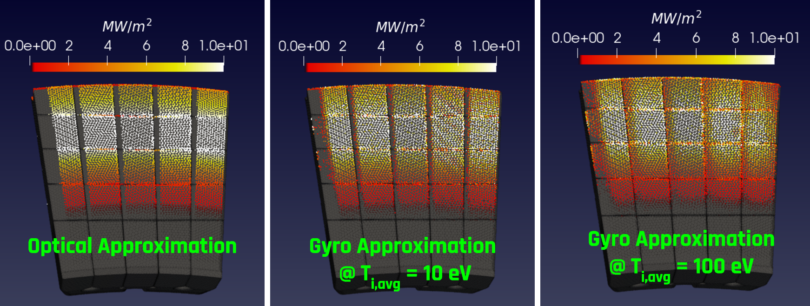
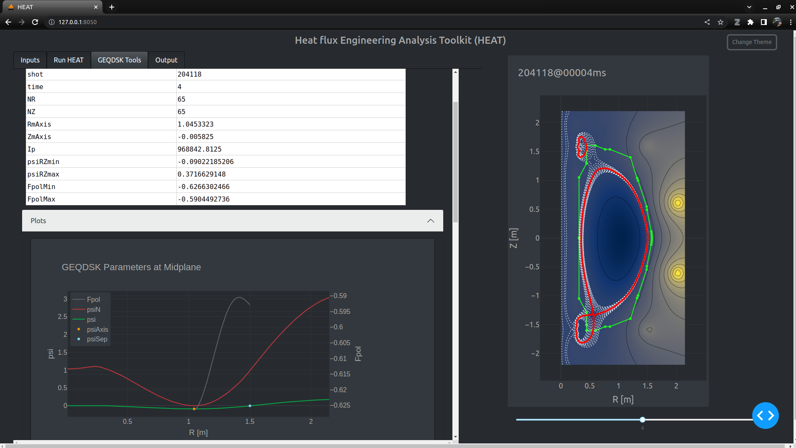
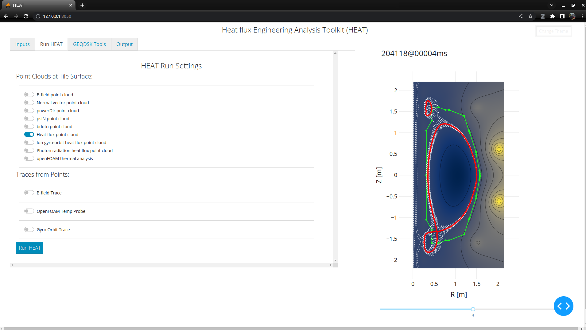

# HEAT
## Description:
The Heat flux Engineering Analysis Toolkit (HEAT) is a suite of tools for predicting the heat flux
incident upon PFCs in tokamaks, and the associated PFC state (ie temperature).  
The toolkit connects CAD, FVM, MHD, ray tracing, plasma physics, and more, in one streamlined package.  
The objective is to enable engineers and physicists to quickly ascertain heat loads given specific magnetic
configurations and geometric configurations.  HEAT has been used to design the SPARC PFCs and will continue to be developed for control room use as SPARC begins operations.

Some examples of what HEAT can predict:
 - 3D heat loads from 2D and 3D plasmas for limited and diverted discharges
 - Heat fluxes from the optical approximation, ion gyro orbit approximation, and photon flux
 - Heat and particle fluxes from filaments
 - 3D heat flux profiles from RMPs and Error Fields
 - Time varying heat loads and temperature profiles
 - Magnetic field line traces
 - Many other quantities
---
The latest release of HEAT is v4.0, which includes the following notable additions / patches:
 - A filament tracer, based upon the Fundamenski Free Streaming Model (W Fundamenski et al 2006 Plasma Phys. Control. Fusion 48 109)
 - Compatibility with M3DC1 equilibria for 3D field tracing and footprints
 - Patch for photon tracing which results in 10X speedup in some cases
 - Numerous other bug fixes and user requests

The following physics modules are scheduled to be added to HEAT soon:
1) GPU support
---
To cite HEAT, you can use a paper published by the journal Fusion Science and Technology under open access.  The paper can be found here: https://doi.org/10.1080/15361055.2021.1951532

Other recent HEAT related publications:
 - SPARC power exhaust workflows using open source tools for plasma facing component design and operational scenario planning, APS DPP Tutorial, https://meetings.aps.org/Meeting/DPP23/Session/JT02.1 , presentation [here](https://docs.google.com/presentation/d/1QsxlfUS6zo_vAwRgFoKKztvUsIzq238u2JmYD6xtum4/edit?usp=sharing)
 - 3D ion gyro-orbit heat load predictions for NSTX-U, Looby et al, https://iopscience.iop.org/article/10.1088/1741-4326/ac8a05
 - 3D PFC Power Exhaust Predictions for the SPARC Tokamak, Looby et al, https://meetings.aps.org/Meeting/DPP22/Session/NO03.11
 - Measurements of multiple heat flux components at the divertor target by using surface eroding thermocouples (invited), Ren et al, https://aip.scitation.org/doi/full/10.1063/5.0101719

 ---
For users who want to run HEAT, you will need to download the HEAT docker container from dockerhub.  There is no longer support for the Linux appImage, as the docker container is OS agnostic and achieves equal speeds as the appImage.  Users must download the docker container to get the HEAT environment.  The HEAT docker container has been tested on Linux, MacOS, and Windows.  See the tutorials link below for more information on installation.

Dockerhub repo:  https://hub.docker.com/r/plasmapotential/heat

There is a companion repo to this one, which provides some HEAT pre/post processing functions:
https://github.com/plasmapotential/HEATtools.git

---
The developer is Tom Looby, a Scientist at Commonwealth Fusion Systems.

This project is open source under the MIT license.

Tom's email:  tlooby@cfs.energy

## Installation and Tutorials
HEAT installation instructions and tutorials can be found here:
https://heat-flux-engineering-analysis-toolkit-heat.readthedocs.io/en/latest/

## Examples:
Below are a few examples of HEAT output.  HEAT produces time varying 3D heat fluxes, and can easily create visualizations leveraging the power of ParaVIEW.  

Here is Tom's APS DPP Invited Tutorial Talk from 2023 [here](https://docs.google.com/presentation/d/1QsxlfUS6zo_vAwRgFoKKztvUsIzq238u2JmYD6xtum4/edit?usp=sharing)

A Dec 2021 presentation available [here](https://docs.google.com/presentation/d/1BF2DvYyuPM_ATutrNDVy_r3_vKbj0a8H2UtDaoGvVg8/edit?usp=sharing)

There is a HEAT presentation from Aug 2020 available [here](https://docs.google.com/presentation/d/1aqJRaxt97P6R4Kqz7xyaoegtxssHQQPuwvJgVM4cCII/edit?usp=sharing)

**Example output for 30 degree section of the NSTX-U divertor with Equilibrium, Heat Flux, Temperature:**

**Example output of PFC tile temperature for various strike points sweep frequencies:**

**Example trace for ion gyro orbit tracing from T. Looby et al 2022 Nucl. Fusion 62 106020:**

**Example output for ion gyro orbit tracing from T. Looby et al 2022 Nucl. Fusion 62 106020:**

**Example output for limited discharges:**

**HEAT Dash GUI Theme Example 1:**

**HEAT Dash GUI Theme Example 2:**

## Contributing

As an open-source software, HEAT is extremely open to contributions. You have many ways to contribute:
1. Discussion (asking for use cases or features)
2. Documentation (add clearest examples or fill non-documented code sections)
3. Code (Add new features or enhance the existing ones)
4. Issues (Help another to achieve the expected use of HEAT or report any problem, bug or misoperation that you can note)