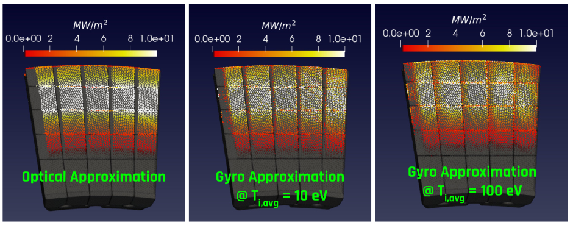

# HEAT
## Description:
The Heat flux Engineering Analysis Toolkit (HEAT) is a suite of tools for predicting the heat flux
incident upon PFCs in tokamaks, and the associated PFC state (ie temperature).  
The toolkit connects CAD, FVM, MHD, Plasma Physics, Visualization, HPC, and more, in one streamlined package.  
The objective is to enable engineers and physicists to quickly ascertain heat loads given specific magnetic
configurations and geometric configurations.

Some examples of what HEAT can predict:
 - 3D heat loads from 2D plasmas for limited and diverted discharges
 - Heat fluxes from the optical and ion gyro orbit approximations
 - Time varying heat loads and temperature profiles
 - Magnetic field line traces
 - Many other quantities

The following physics modules are scheduled to be added to HEAT soon:
1) Photon tracing, ie radiated power using CHERAB
2) 3D plasmas using M3DC1

A HEAT paper has been published by the journal Fusion Science and Technology under open access and can be found here: https://doi.org/10.1080/15361055.2021.1951532

For users who want to run HEAT, there are two options:
 - An appImage for running with a single executable on Linux
 - A docker container, which also allows HEAT development

The appImage is available under the Releases tab on this github page.  The docker container is available via docker hub.

The developer is Tom Looby, a Postdoctoral Researcher at Oak Ridge National Laboratory.  The project began during Tom's PhD.  

This project is open source under the MIT license.

Tom's email:  loobytp@ornl.gov

## Installation and Tutorials
HEAT installation instructions and tutorials can be found here:
https://heat-flux-engineering-analysis-toolkit-heat.readthedocs.io/en/latest/

## Examples:
Below are a few examples of HEAT output.  HEAT produces time varying 3D heat fluxes, and can easily create visualizations leveraging the power of ParaVIEW.  

There is a HEAT presentation from Aug 2020 available [here](https://docs.google.com/presentation/d/1aqJRaxt97P6R4Kqz7xyaoegtxssHQQPuwvJgVM4cCII/edit?usp=sharing)

And a presentation from Dec 2021 available [here](https://docs.google.com/presentation/d/1BF2DvYyuPM_ATutrNDVy_r3_vKbj0a8H2UtDaoGvVg8/edit?usp=sharing)

Example output for 30 degree section of the NSTX-U divertor with Equilibrium, Heat Flux, Temperature:

Example output of PFC tile temperature for various strike points sweep frequencies:

Example trace for ion gyro orbit tracing:

Example output for ion gyro orbit tracing:

Example output for limited discharges:

HEAT Dash / plotly GUI:

