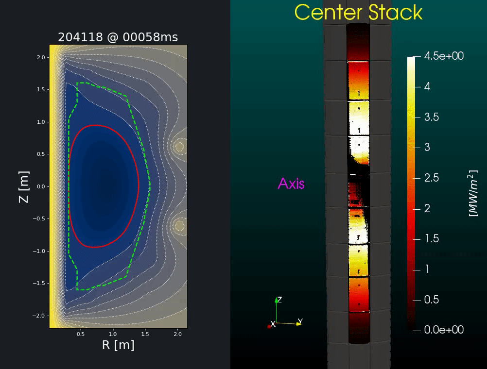
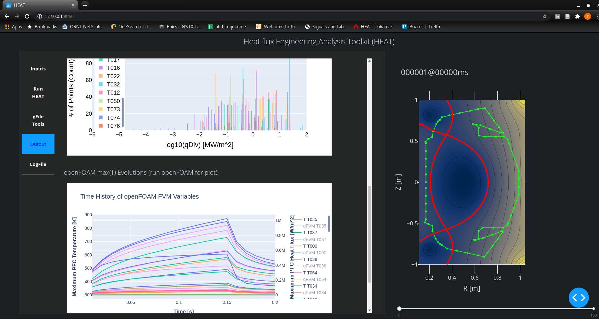
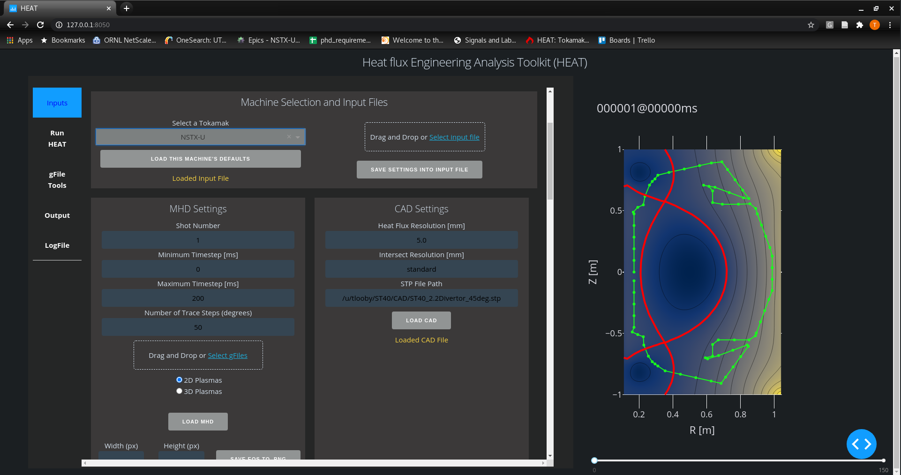

# HEAT
The Heat flux Engineering Analysis Toolkit (HEAT) is a suite of tools for predicting the heat flux
incident upon PFCs in tokamaks.  The toolkit connects CAD, FEM, MHD, Plasma Physics, Visualization,
HPC, and more, in one streamlined package.  The objective is to enable engineers and physicists to
quickly ascertain heat loads given specific magnetic configurations and geometric configurations.

If a user wants to use HEAT without building it on his/her local machine, then they can directly
access HEAT from a web browser inside the Princeton Plasma Physics Lab (PPPL) VPN.  For instructions
on where to point your web browser email Tom Looby (email below).

If a user wants to set up HEAT on a local machine there are a variety of configuration steps that need to be completed (ie compiling MAFOT, building OF modules from source, installing FLASK, network configuration and proxy mapping, ParaViewWeb install, etc.).  We are currently working on an appImage (or VM) that will enable users to install locally without any setup (fall 2020).  For more info, again, contact Tom.

The author engineer is Tom Looby, a PhD candidate on assignment at NSTX-U for Oak Ridge National Lab.
This project is an Oak Ridge National Lab tool built by the Fusion Energy Division, but it is also
openSource under the MIT license.

We are currently looking for collaborators, so if you feel like you could use HEAT, reach out!

Tom's email:  tlooby@vols.utk.edu

Below are a few examples of HEAT output.  HEAT produces time varying 3D heat fluxes, and can easily create visualizations leveraging the power of ParaVIEW.

Example output for 30 degree section of the NSTX-U divertor with Equilibrium, Heat Flux, Temperature:

Example output of PFC tile temperature for various strike points sweep frequencies:

Example output for limited discharges:

HEAT DASH / plotly GUI:

